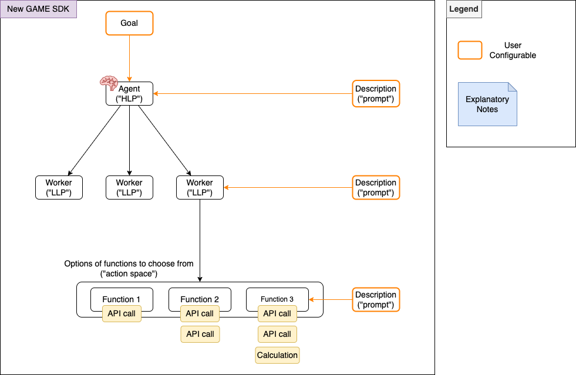
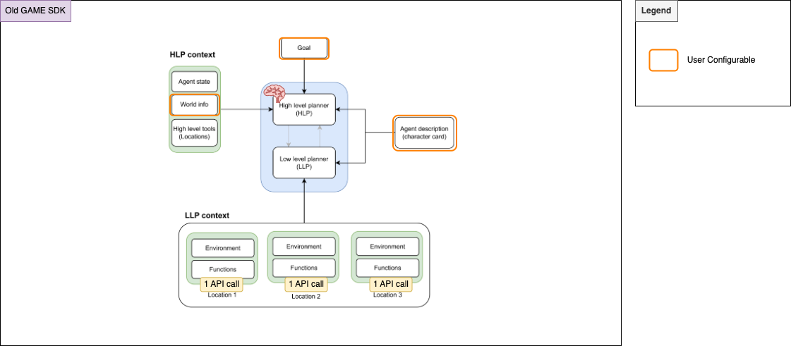

# GAME Python SDK Library
The GAME Python SDK is a library that allows you interact and develop agents powered by the GAME architecture.

## Installation
```bash
pip install game_sdk
```

To get the latest version of the SDK, clone the repository and install from source:
```bash
git clone https://github.com/game-by-virtuals/game-python.git
cd game-python
pip install -e .
```

## Usage
Please refer to [`test_agent.py`](examples/game/test_agent.py) and [`test_worker.py`](examples/game/test_worker.py) for usage examples.

## About G.A.M.E.
GAME is a modular agentic framework which enables an agent to plan actions and make decisions autonomously based on information provided to it.

Please refer to our [whitepaper](https://whitepaper.virtuals.io/developer-documents/game-framework) for more information and resources.

## About GAME Python SDK
Currently, this SDK allows you to develop your agents powered by the GAME architecture in its most fullest and most flexible form.


The python SDK is made up of 3 main components (Agent, Worker, function), each with configurable arguments.

Agent (a.k.a. [high level planner](https://whitepaper.virtuals.io/developer-documents/game-framework/game-overview#high-level-planner-hlp-context))
- Takes in a <b>Goal</b>
  - Drives the agents behaviour through the high level plan which influences the thinking and creation of tasks that would contribute towards this goal
- Takes in a <b>Description</b>
  - Combination of what was previously known as World Info + Agent Description
  - This include a description of the "world" the agent lives in, and the personality and background of the agent

Worker (a.k.a. [low-level planner](https://whitepaper.virtuals.io/developer-documents/game-framework/game-overview#low-level-planner-llp-context)) 
- Takes in a <b>Description</b>
  - Used to control which workers are called by the agent, based on the high-level plan and tasks created to contribute to the goal

Function
- Takes in a <b>Description</b>
  - Used to control which functions are called by the workers, based on each worker's low-level plan
  - This can be any python executable

## Features
- Develop your own custom agents for any application or platform. 
- Ability to control your agents and workers via descriptions (prompts)
- Full control of what the agent sees (state) and can do (actions/functions)
- Ability to fully customise functions. This could include various combinations of programmed logic. For example:
  - Calling an API to retrieve data
  - Calling an API to retrieve data, followed by custom calculations or data processing logic in python code
  - 2 API calls chained together (e.g. calling an API to retrieve web data, and then posting a tweet)

> ### ℹ️ Changes from older python SDK version (prior to 8 Jan 2025)
>
> - Ability to fully customise functions (previously, each function was a single API call)
> - Ability to control the low-level planner via description prompt (previously, only the high-level planner and functions could be controlled via description prompts)
> - The description defined in the agent is equivalent to what was previously known as world information and agent description


## How to Contribute
Contributions are welcome, especially in the form of new plugins! We are working on creating a plugins repo, but in meantime - please contact us via [Twitter](https://x.com/GAME_Virtuals) or [Telegram](https://t.me/virtuaIs_io).

## Documentation
Detailed documentation to better understand the configurable components and the GAME architecture can be found on [here](https://whitepaper.virtuals.io/developer-documents/game-framework).

## Useful Resources
- [GAME TypeScript SDK](https://www.npmjs.com/package/@virtuals-protocol/game): The core logic of this SDK mirrors the logic of this python SDK if you prefer to develop your agents in TypeScript. Tyepscript SDK repository and contributed typescript plugins can be found [here](https://github.com/game-by-virtuals/game-node).
- [Hosted GAME Agent](./src/game_sdk/hosted_game/README.md): This SDK also enables configuration and deployment of an out-of-the-box hosted agent that can be used to interact with the Twitter/X platform, powered by GAME. This agent comes with existing functions/actions that can be used to interact with the Twitter/X platform and can be immediately hosted/deployed as you configure it. This is similar to configuring your agent in the [Agent Sandbox](https://game-lite.virtuals.io/) on the [Virtuals Platform](https://app.virtuals.io/) but through a developer-friendly SDK interface.
